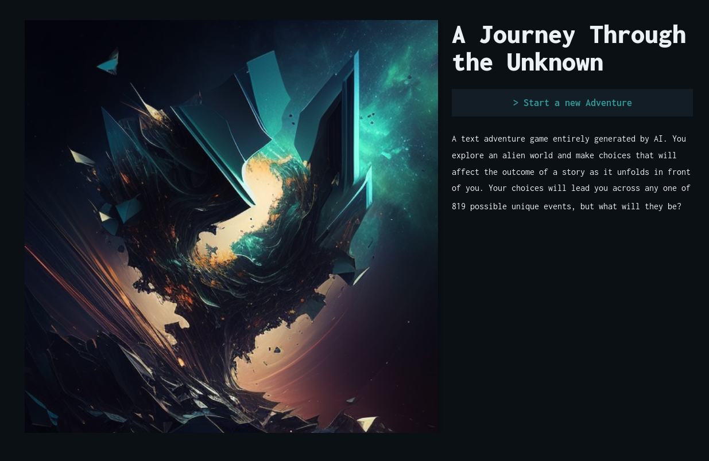

We are excited to release an early preview version of **Prompt Studio**! After several weeks of work, we feel that we have a solid foundation for something that will be useful to anyone building applications on top of Language Models. Prompt Studio is an attempt at providing Prompt Engineers with the kind of tools we are accustomed to in Software development. How Prompt Studio will shape up will depend on you and other early adopters.

Our goal is to tailor this tool to provide the best developer experience for anyone needing to experiment, fine-tune or test prompts. Our mission is to help you find the right words to interact with your AI systems.

Let us know what features **you** need on [Github](https://github.com/pufflyai/prompt-studio-docs/discussions/categories/ideas), or get in touch on [Discord](https://discord.gg/3RxwUEk8fW).

## Why Prompt Studio?

Last month I created [a video game](https://au-re.itch.io/a-journey-through-the-unknown) as part of the "All by AI" game jam competition on [Itch.io](https://itch.io/jam/allbyai). The game is a digital novel entirely generated by GPT-3 where each action you take changes what happens next in the story. Each scene, in turn, defines what actions are available to you, those actions are also created by GPT-3.



The challenge was finding the correct words to not only get text that makes sense but also follows a certain writing style and exhibits a certain mood.

A prompt in the game would look like this:

```js
const prompt = `You are a narrator writing in the second person.
The story you tell is a sci-fi story set in the distant future.

Previously the following happened:
1. The protagonists spaceship crashed on a desertic planet.

Lastly, the protagonist did the following action:
The protagonist explored the surroundings.

Describe what happens next in the story, within a paragraph of 80 words or less.`;
```

This prompt is composed of several variable pieces that each can affect the quality of the result in different ways. For example, in the case above we need to feed everything that has happened in the story so far back to the model since it has no memory.

But how do you know what would happen if you change a word or the order of a sentence? There are no good tools for this type of work as of now (I looked).

So I decided to build my own.

## Working with Prompt Studio

When building more complicated applications you quickly outgrow tools like [GPT playground](https://platform.openai.com/playground). I wanted a tool that allows me to:

1. keep track of my prompts and their completions
2. easily compare results between prompts
3. create large numbers of prompts from a template
4. compare results across different language models


Over the past month I have been working on implementing these features. There is still work ahead but first I want to check what features **you** might need from such a tool.

Checkout [our documentation](https://docs.prompt.studio) to learn more about what the current capabilities of prompt studio are.

## Prompt Engineering is taking off

As AI becomes capable of performing various tasks at levels similar to that of a humans, we will rely more on it to automate certain work. The more we rely on language models for automated tasks, the more prompts and how we write them become important. This is not a transitory phase while our AI models become better.

Human language is not precise and while models might get better at discerning intent in the requests we make towards them, there will always be a gap inherent to natural language. With people we are accustomed to a certain back and forth to clear misunderstandings but we are much less tolerant of these inefficiencies when it comes to machines.

From this perspective Prompt Engineering is the search for a way to formalize intent in natural language and I think that as AI becomes more human like in its capabilities, making sure the results it produces are aligned with our intents will only become more important.

If you want to learn more about Prompt Engineering here are a few amazing resources:

[prompt-engineering-guide](https://github.com/dair-ai/Prompt-Engineering-Guide)

## What's next for Prompt Studio?

Our development roadmap is open and you are welcome to tell us what we should focus on next.

[Check it out on Github](https://github.com/orgs/pufflyai/projects/6/views/4).

**We are looking forward to hear from you!**
