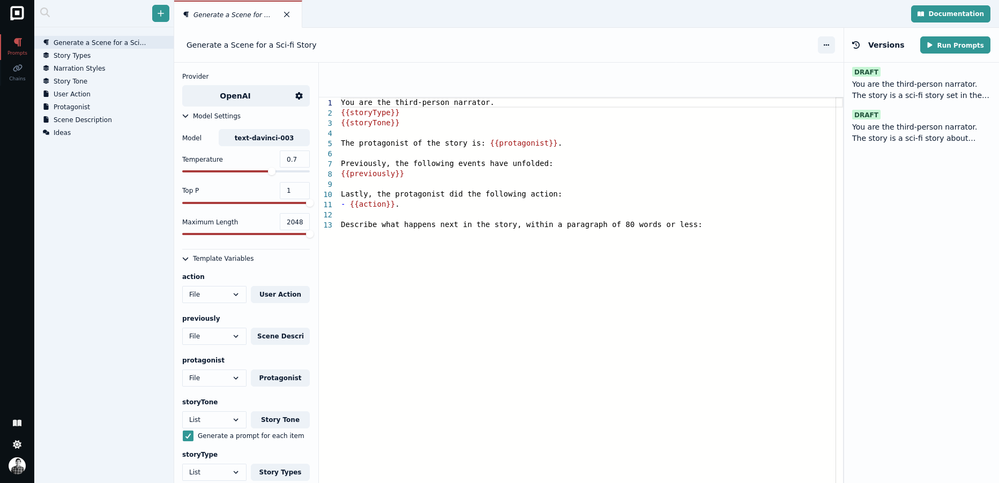
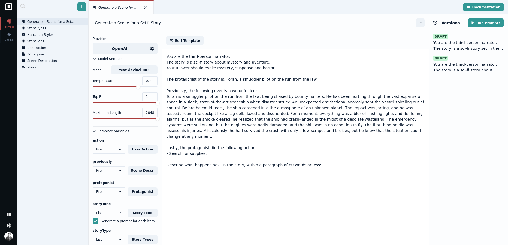
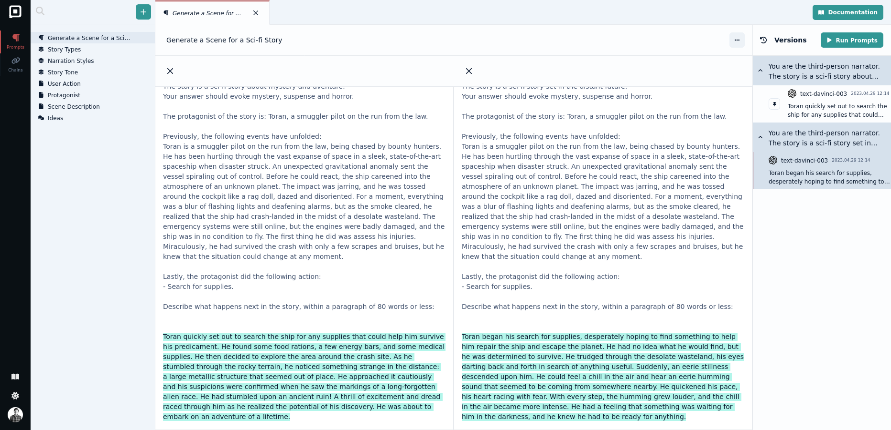
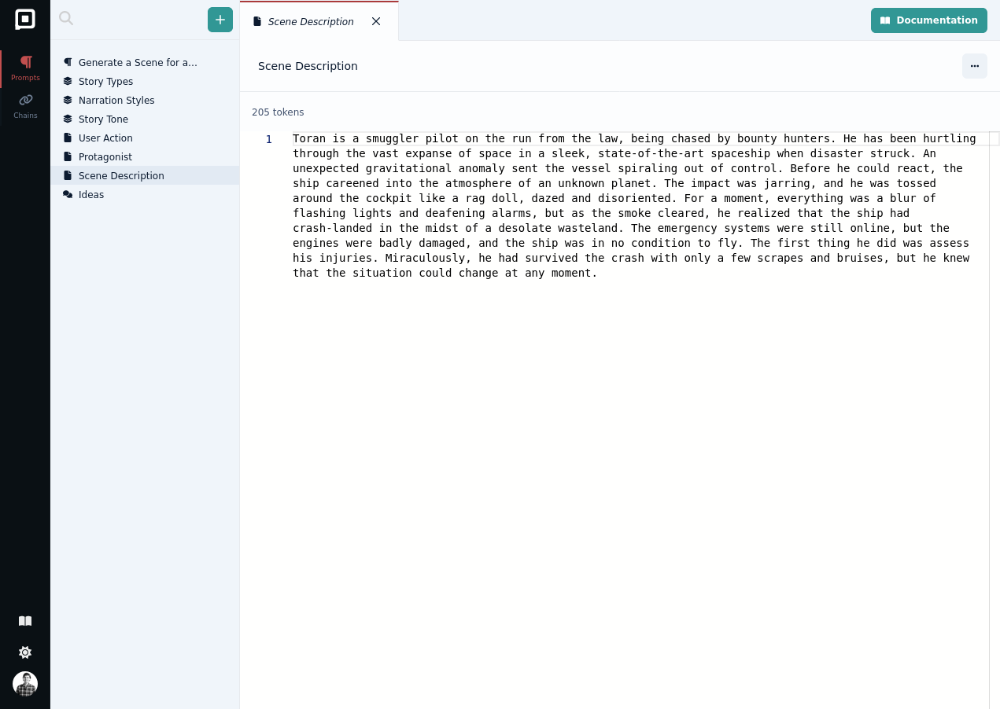

Over the past month we have improved the developer experience when working with prompt templates. The latest version of Prompt Studio allows you to include external text into your prompts like lists and files. We have also been busy preparing a new feature allowing you to create knowledge bases from your files and integrate them into your prompts and chats. Come back next week to learn more!

Here is what we have been working over the past weeks:

## Prompt Versions and Completions

We have reworked how we present prompt completions to you, every time you create a completion with Prompt Studio that version of your prompt is saved. All completions done with the same prompt, but with different models or settings (Temperature, Top P or maximum length), will be grouped together, and you can now **compare prompt completions side by side**. This makes it really easy to compare how different language models perform, or how parameters like "temperature" affect your results.

### Drafts

A draft is a prompt created from your prompt template that you have not saved yet. In the example below your prompt template results in two different drafts because the option "generate prompt for each item" is selected for the "storyTone" variable. When clicking run Prompts, all your drafts will be run at once, so that you can easily compare results, and revert to a previous version of your prompt at a later stage.

### Preview a Prompt

You can preview the content of your prompt by clicking on the draft item in the prompt version list. All variables are inserted into the prompt and you can make sure everything is configured correctly before running it.

### Comparing completions

Once you run your prompts, completions will be generated and you can now compare them with each other:

With that foundation in place, here are features we will be adding soon:

- Save a specific version of a prompt template
- Revert to a version of your prompt template
- Delete Prompt versions and completions you don't need
- Run individual prompts instead of all draft prompts

## Working with Files

To test your prompts you need to try them out on different sets of data, **the same prompt might perform very differently given different user inputs**. This is why we added a new feature allowing you to create files and link them into your prompts. This way you can check if your prompt performs the way you expect in different scenarios. You can also preview the number of tokens a file might have.

Currently you need to copy paste the file content into Prompt Studio, we know this is not ideal and we are working on improving this. Down the line you will be able to:

- Drag and drop files into the editor
- Tokenize PDFs and other Documents directly in Prompt Studio

## Chats

Interacting in a chat format allows you to build up a question or request across several prompts. This is incredibly useful when you have more complex tasks for a language model. Our current chat interface is a starting point for many new features we intend to add in the coming weeks.

There are many things we want to add to this early preview, but we need your help to understand what features you need the most, and what we should work on first. Reach out to us on [Github](https://github.com/pufflyai/prompt-studio-docs/discussions/categories/ideas), or get in touch on [Discord](https://discord.gg/3RxwUEk8fW).
