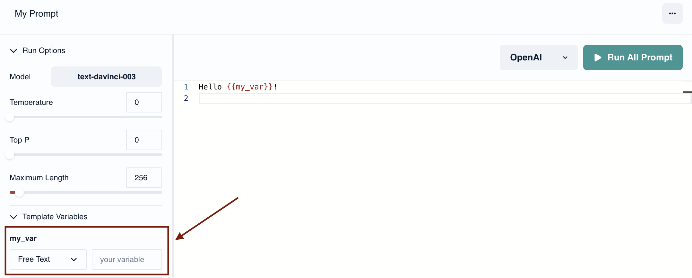
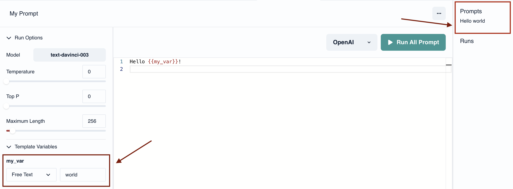
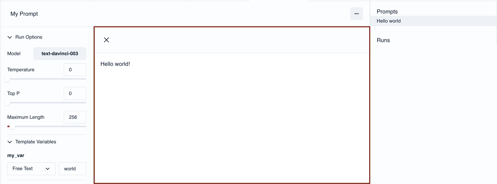
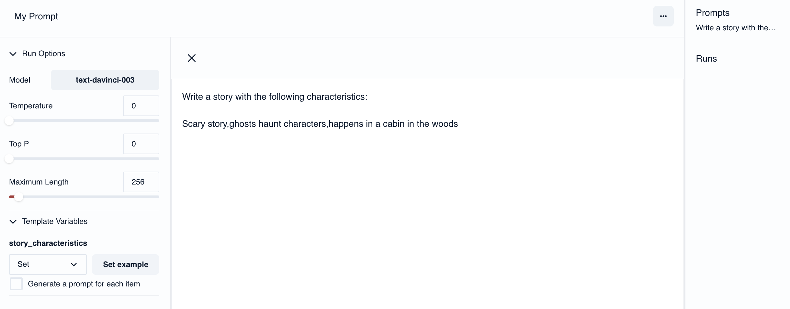
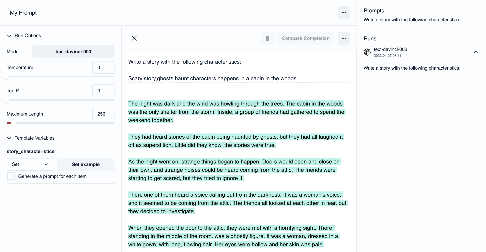

import sad_image from "../images/completions/sad_mood_story.png";
import happy_image from "../images/completions/happy_mood_story.png";
import story_characteristics from "../images/sets/create_story_characteristics_set.png";
import story_moods from "../images/sets/moods.png";
import several_prompts from "../images/screenshots/select_several_prompts.png";
import loops_var from "../images/sets/loops_var.png";

# Templates

A template allows you to create variations of prompts from data.

When creating a prompt you can make use of templates to quickly insert data in your prompt, or create large numbers of prompts from a [set](./sets).

## Syntax

PromptStudio uses [Mustache](https://mustache.github.io/) as a template language. Below are a few examples of its usage:

### Template with Free-text variable

If you write the following in your template draft:

```md title="template"
Hello {{my_var}}!
```

Then on the left side, as shown with the arrow below, a variable dropdown will be created where you can set your value. In this example, we will set the variable type of be 'Free text'



When you fill in your value and click on **_Enter_**, a prompt will be generated here:



You can then click on the generated prompt on the right tab to see the full prompt preview in the center tab as shown here:



### Template with a Set as variable

Let's say that you create a set like this one:


You can write a template like this for example

```
Write a story with the following characteristics:

{{story_characteristics}}
```

After setting the `story_characteristics` to the set that we created above, a prompt will be generated looking as follows:



After clicking on **_Run Prompt_**, the result is this:



### Generating several prompts from a set

Sometimes you want to compare completions over large numbers of prompts. With Prompt Studio you can do that by assigning a set to a variable and selecting "Create completion for each item".

Given the template:

```
A cat named Mumin goes out for a walk. He suddenly stops when he sees a tiny puffy creature. Generate a {{mood}} continuation to the story.
```

Let's say that you have the following set of story moods that you are passing as the `mood` variable:


You can generate several prompts and compare their results by selecting this checkbox in the **_Template variables_** area


If you click on **_Run Prompt_**, you will get the following two prompts with their respective completion:


### Loops

You can also loop over your data within a single prompt, given the template below:

```
Hello

{{#names}}
- {{.}}
{{/names}}
```

And the variables:


The following prompt will be generated:

```md title="prompt"
Hello

- Moomin
- Snufkin
- Groke
```

### Comments

You can also write comments in your prompt templates.

```
{{! this is a multiline comment and will not
be part of any prompt created from this template
}}
```

## Usecases

This can be useful in different scenarios.

### Few Shot Prompting

In few-shot prompting you provide a set of examples as part of your prompt. In some scenarios this can produce more
accurate results.

```md
Is the following sentence positive or negative?

Examples:

This is awesome! // Positive
This is bad! // Negative
Wow that movie was rad! // Positive

Sentence:

What a horrible show! //
```

Given the additional information from the example above, the model would complete the prompt with

```md
Negative
```

With a template we can extract this type of data out of the prompt:

```mustache
Is the following sentence positive or negative?

Examples:

{{#examples}}
{{.}}
{{/examples}}

Sentence:

{{userQuery}} //
```

Now you can provide different sets of examples and test the prompt on different types of queries and easily compare the
results between runs.
