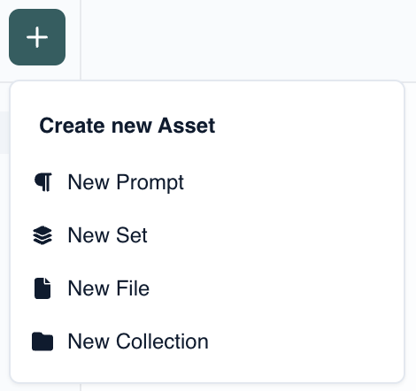

# Concepts

We currently support **four** types of assets:

- [Collection](#collection)
- [Prompt](/concepts/Assets/Prompts)
- [Set](/concepts/Assets/sets)
- [File](/concepts/Assets/Files)

To create an asset, click on the **+** button, you will see the assets, as seen below.

### Collection

A collection groups multiple assets: a prompt, set, file or another collection. You can use it organize your assets. We are working on adding a feature to be able to share collections with others.
