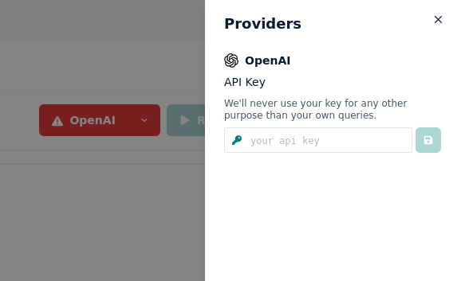

# Integrations

Integrations allow you to test your prompts towards different model providers.

:::info
Currently we only integrate with the OpenAI APIs, but our goal is to allow you to connect to any ML model / API, locally and in the cloud.
:::

## OpenAI

In order to use Prompt studio with OpenAI, you will need to provide your OpenAI API Key.

### Setup

Click on the OpenAI button to open the Providers menu and enter your API key in the input field

