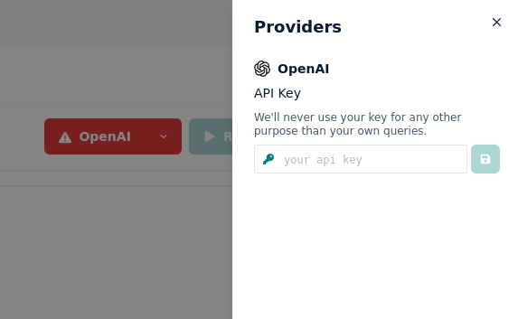

# Integrations

Integrations allow you to test your prompts towards different model providers.

:::info
Currently we only integrate with the OpenAI APIs, but our goal is to allow you to connect to any ML model / API, locally and in the cloud.
:::

## OpenAI

In order to use Prompt studio with OpenAI, you will need to provide your OpenAI API Key.

### Setup

Click on the OpenAI button to open the Providers menu and enter your API key in the input field

:::info
You will get an error on Prompt Studio when setting up your openAI key If you have not set up billing in your OpenAI account. To do this, click on your profile picture at the top right -> 'Manage account', then select 'Billing' on the left side. There you can set a billing plan. Your key should work on Prompt Studio after that.
:::
