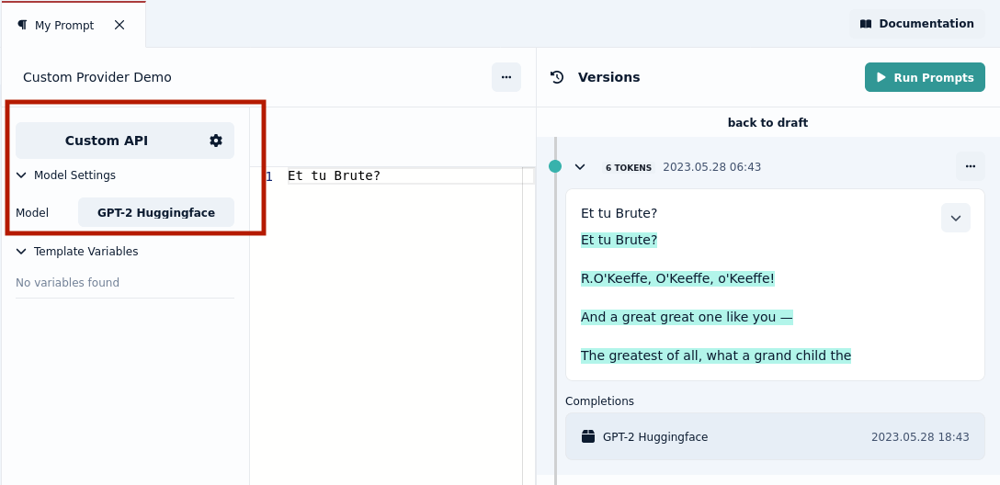

import settings_section from "./images/providers/settings_section.png";
import open_ai from "./images/providers/openai.png";
import hugging_face from "./images/providers/huggingface_api.png";
import hugging_face_config from "./images/providers/huggingface_config.png";
import providers_list from "./images/providers/providers_list.png";

# Integrations

Integrations allow you to test your prompts towards different model providers.

## Setting up the LLM providers

As of today, you have three alternatives to providers: openAI, custom API and Prompt studio. With the **_Prompt Studio_** alternative, you have access to 10 free
prompts per day.

After clicking on the cogwheel, the providers settings section shows up.

### OpenAI
To set the openAI key, you paste the openAI key into the API key field and click on the save icon, as shown down here:

####
:::info
You will get an error on Prompt Studio when setting up your openAI key If you have not set up billing in your OpenAI account.
 To do this, click on your profile picture at the top right -> _Manage account_, then select _Billing_ on the left side. There 
 you can set a billing plan. Your key should work on Prompt Studio after that.
:::
### Setting up your custom API for your LLM 
You can now use the new Custom API Model Provider to connect to a language model you are hosting yourself with your own API. 
This requires a bit of configuration, but is the most flexible setup and you can already use it while we add more integrations. The image below shows the setup to integrate to a custom GPT-2 model deployed on Huggingface.

Above is a deployed GPT-2 API on [Huggingface Inference Endpoints](https://huggingface.co/docs/inference-endpoints/index). 
Below is the corresponding configuration for the **Custom API Model Provider**.

You can now select the custom provider when making your requests:

