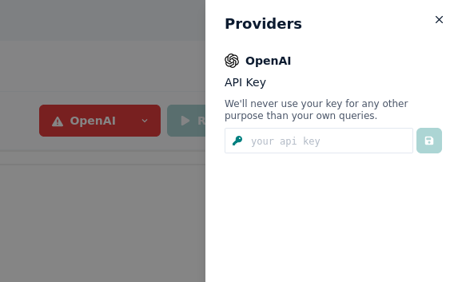

# Overview

**Prompt Studio** is a tool designed to help you explore, test and manage your prompts with different AI systems. With
Prompt Studio you can compare results from different models, quickly explore prompt variations and test different use
cases. Additionally, Prompt Studio will provide collaborative features, allowing you to share workspaces with others and
collaborate in real-time.

Prompt Studio aims to become the go-to tool for engineering prompts for language models.

Think of it like **Postman but for LLMs**.

:::info
You are currently using a preview version of Prompt Studio. If you find the idea useful but you lack a specific feature,
please [let us know](https://github.com/pufflyai/prompt-studio-docs/discussions/categories/ideas).
:::

> **[Checkout what we are working on right now](https://github.com/orgs/pufflyai/projects/6/views/2)**

> **[Make a feature request](https://github.com/pufflyai/prompt-studio-docs/discussions/categories/ideas)**

> **[Get in touch](https://discord.gg/3RxwUEk8fW)**

## Getting Started

Before you can start using Prompt Studio you will need to Sign up using your github or google account.

### Setting up a Provider

Currently Prompt Studio integrates with OpenAI APIs. Our goal is to allow you to connect to any ML model / API. Click on the OpenAI button to open the Providers menu and enter your API key in
the input field

Once the Provider is setup you will be able to make requests towards it.

:::info
You will get an error on Prompt Studio when setting up your openAI key If you have not set up billing in your OpenAI account. To do this, click on your profile picture at the top right -> _Manage account_, then select _Billing_ on the left side. There you can set a billing plan. Your key should work on Prompt Studio after that.
:::

## What's next?

- [Learn how to write templates in Prompt Studio](/concepts/templates)
- Learn more about [Prompt Engineering](https://www.promptingguide.ai/)
- Get involved in the [Prompt Studio Community](https://discord.gg/3RxwUEk8fW)
